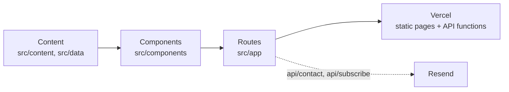

# openk_research_site

Source for [openkresearch.com](https://openkresearch.com), the website of OpenK Research: independent quantitative research on the shape of market uncertainty.

[](https://github.com/maxskrehbiel/openk_research_site/actions/workflows/ci.yml)  

## Overview

OpenK Research studies forward return distributions, options-implied distributions, and the market's moving long-run reference. This repository is the website that publishes that work: essays and research-program write-ups, a K-curve figure built from public S&P 500 monthly closes, and an interactive exhibit of market-implied return distributions on selected historical dates. It is a Next.js App Router site in which every page is prerendered at build time. The only code that runs per request is the contact form and the research-notes signup, both of which send through Resend. The research models themselves are not part of this repository.

## Architecture



| Stage      | What it holds                                                                                                   |
| ---------- | --------------------------------------------------------------------------------------------------------------- |
| Content    | Article text in `src/content/articles.ts` and small, pre-aggregated exhibit data in `src/data/`.                |
| Components | Hand-written UI and chart components. Charts are SVG and Canvas; there is no UI framework or charting library.  |
| Routes     | App Router pages, `sitemap.xml`, `robots.txt`, and two POST API routes.                                         |
| Vercel     | Serves the prerendered pages and runs the two API routes as functions, with the headers from `next.config.mjs`. |

## Quickstart

```bash
git clone https://github.com/maxskrehbiel/openk_research_site.git
cd openk_research_site
npm ci
npm run dev        # http://localhost:3000
```

Requires Node.js 20.9 or newer. No environment variables are needed to run the site locally.

## Usage

| Script                 | What it does                                                                        |
| ---------------------- | ----------------------------------------------------------------------------------- |
| `npm run dev`          | Development server on port 3000                                                     |
| `npm run build`        | Production build; prerenders every page                                             |
| `npm start`            | Serves the production build                                                         |
| `npm run lint`         | ESLint with the Next.js Core Web Vitals rules and typescript-eslint                 |
| `npm run typecheck`    | `tsc --noEmit`                                                                      |
| `npm run format:check` | Prettier check; `npm run format` rewrites files                                     |
| `npm test`             | Vitest unit tests; `npm run test:coverage` adds a coverage report                   |
| `npm run preflight`    | Fails if env files, raw data dumps, logs, key material or files over 1 MB are found |

The forms need these server-side variables in production. Never commit real values.

| Variable               | Purpose                                                                                   |
| ---------------------- | ----------------------------------------------------------------------------------------- |
| `NEXT_PUBLIC_SITE_URL` | Public base URL for canonical links and the sitemap (defaults to `http://localhost:3000`) |
| `RESEND_API_KEY`       | Resend API key                                                                            |
| `RESEND_AUDIENCE_ID`   | Resend Audience that signups are added to                                                 |
| `CONTACT_TO_EMAIL`     | Inbox that receives contact-form messages                                                 |
| `CONTACT_FROM_EMAIL`   | Sender address on a domain verified in Resend                                             |

Without Resend configured, the forms append to git-ignored `*.log` sink files in development and return 503 in production, so a submission is never silently dropped.

## How it works

### Content model

Each article in `src/content/articles.ts` is typed data: a kind (thesis, note or program), a title, a dek, sections of paragraphs, and optional takeaways, references and related slugs. Theses render under `/ideas/<slug>` and notes and programs under `/research/<slug>`. An article is public only when `draft` is `false`; drafts render in development for previewing and are excluded from production pages and the sitemap.

### Static prerendering

`next build` renders every page to HTML ahead of time. The article routes list their slugs through `generateStaticParams` and set `dynamicParams = false`, so an unknown slug is a 404 rather than an on-demand render. The charts are drawn from the bundled data: the K-curve figure and the wedge diagram as server-rendered SVG, and the hero and the implied-distribution exhibit on a canvas in the browser. The exhibit turns each episode's return quantiles into a piecewise-linear CDF and a density (probability mass between neighboring quantiles divided by their width, then Gaussian-smoothed); that math lives in `src/lib/implied_density.ts`.

### API routes

`/api/contact` and `/api/subscribe` accept same-origin JSON POSTs only. Each route refuses any other content type (415) and any request whose browser reports another site as its origin (403), so a page elsewhere cannot make a visitor's browser submit the forms. Each then rejects a body that is not a JSON object, checks field types and lengths, accepts only the contact form's listed topic and role values, accepts a filled honeypot field quietly without acting on it, and rate-limits by client address: five requests per minute per address, with a separate budget for each route. Valid contact messages are emailed with the sender as reply-to; valid signups are added to a Resend Audience.

### Security headers and CSP

`next.config.mjs` sends a Content Security Policy, HSTS, `X-Content-Type-Options`, `Referrer-Policy`, `Permissions-Policy` and `X-Frame-Options: DENY` on every response, and disables the `X-Powered-By` header and production source maps. The policy allows only same-origin scripts, styles, images, fonts and connections, plus the inline scripts and styles the Next.js runtime needs.

## Project layout

```
openk_research_site
├── .github/workflows/ci.yml   install, lint, format, type check, test, build, preflight
├── public/                    logo and social images
├── scripts/preflight.mjs      publication preflight
├── src/
│   ├── app/                   routes: pages, API routes, sitemap, robots, global styles
│   ├── components/            UI and chart components
│   │   └── home/              one component per home-page section
│   ├── content/articles.ts    article text and the publish and path helpers
│   ├── data/                  pre-aggregated exhibit data
│   └── lib/                   env, metadata, formatting, density math, rate limiting, request input, contact options, Resend
├── tests/                     Vitest unit tests
├── eslint.config.mjs
├── next.config.mjs            security headers, Content Security Policy
└── vitest.config.mts
```

## Development

```bash
npm run lint
npm run format:check
npm run typecheck
npm run test:coverage
npm run build
npm run preflight
```

CI runs these commands, in this order, on Node.js 22 for every push and pull request to `main`. Builds use Turbopack, the Next.js 16 default; the `@/` import alias comes from `paths` in `tsconfig.json`. The tests cover the rate limiter, request parsing and validation, both API routes (called directly with `Request` objects, with Resend and the development sink mocked), the density math, metadata, number formatting, the article catalog and the sitemap.

## Data

`src/data/implied.json` holds market-implied return quantiles for five historical dates at four horizons, recovered from option prices with the Breeden-Litzenberger relation, then curated, downsampled and rounded as displayed on the home page. No raw or row-level options data is included. `src/data/spx.json` holds widely available historical S&P 500 monthly closing levels, rounded and used illustratively, and the smooth illustrative reference line drawn in the K-curve figure. The realized outcomes in `implied.json` come from the same public index levels.

"S&P 500" is a trademark of S&P Dow Jones Indices LLC. This project is not sponsored or endorsed by S&P Dow Jones Indices.

## Limitations

- The rate limit is kept in memory. On serverless hosting each function instance has its own counters, which reset on cold start, so it slows casual abuse rather than enforcing a global quota.
- The client address comes from the first `X-Forwarded-For` entry, which is only trustworthy behind a proxy that sets it, as Vercel does.
- The Content Security Policy allows `'unsafe-inline'` scripts and styles because the Next.js runtime injects inline bootstraps; per-request nonces would tighten it.
- The tests are unit tests. Page rendering is checked by the production build rather than by browser tests.

## Content license

**Content is not MIT-licensed.** The article text in `src/content/`, the written copy on the site's pages, the derived distributions and reference line in `src/data/`, and the OpenK Research name, wordmark, and logo images are © 2026 Maxwell Krehbiel. All rights reserved. They may not be copied, republished, or reused without written permission. No rights are claimed in the underlying S&P 500 index levels, which belong to their owners.

OpenK Research is independent research, not investment advice.

## References

Breeden, D. T., & Litzenberger, R. H. (1978). Prices of state-contingent claims implicit in option prices. _The Journal of Business_, 51(4), 621–651.

## License

The code (components, layouts, styles, API routes, configuration, and scripts) is released under the MIT License © Maxwell Krehbiel. See [LICENSE](LICENSE).
